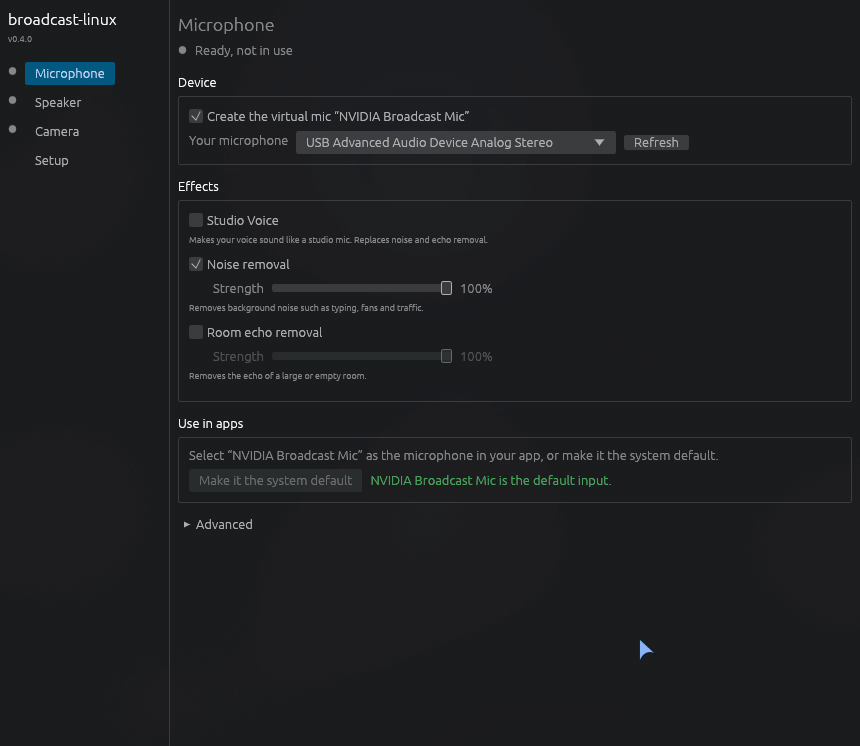

# broadcast-linux

NVIDIA Broadcast effects on Linux, with a native settings window and virtual mic,
speaker and camera. Effects run through Wine and start when an app uses them.



- **Microphone:** noise removal, room echo removal, Studio Voice
- **Speaker:** noise and room echo removal for incoming call audio
- **Camera:** video noise removal, background replacement/blur/removal, Studio Light,
  Eye Contact, Auto Frame

## Requirements

### NVIDIA hardware

[NVIDIA's published hardware requirements](https://www.nvidia.com/en-us/geforce/broadcasting/broadcast-app/faq/):

- GeForce RTX 2060, Quadro RTX 3000, TITAN RTX or newer
- 8 GB RAM or more
- Recommended CPU: Intel Core i5-8600 or AMD Ryzen 5 2600 or newer
- Studio Voice and Studio Light (Virtual Key Light) require a GeForce RTX 3060 desktop GPU
  or higher

### Linux app

- x86_64 Linux with systemd user services. Release binaries require glibc 2.39+.
- NVIDIA proprietary Linux driver with CUDA and Vulkan support. Bundled DXVK 3.x requires
  [driver 575.51.02 or newer](https://github.com/doitsujin/dxvk/wiki/Driver-support)
- Wine 11+, PipeWire and its client library, WirePlumber, PulseAudio compatibility
  (`pipewire-pulse`) and `pactl`
- A Wayland or X11 desktop session. The settings window also needs OpenGL.
- **Camera:** v4l2loopback 0.12.6+ and access to the video devices (usually the `video` group)
- Internet access and about 8 GB free disk space during setup

## Install

**Arch Linux (AUR):**

```sh
paru -S broadcast-linux-bin
```

**Other distributions:** install the requirements above, download and unpack the
[release tarball](https://github.com/kengzzzz/broadcast-linux/releases), then run
`./install.sh` inside it. It installs to `~/.local`. Add `~/.local/bin` to your `PATH`.

## Get started

1. Open **broadcast-linux** from your app menu, or run `broadcast-linux-gui`.
2. On **Setup**, click **Download and install** and accept NVIDIA's licence.
   The download is about 2.2–2.4 GB depending on your GPU. Start the service on the same page.
3. Choose your devices and effects, then **Apply**. For the camera, follow the
   **Camera** page's module and permission steps. Log in again after joining the video group.
4. In your call or recording app, select **NVIDIA Broadcast Mic** and **Broadcast Camera**.
   Enable the speaker if needed and select **NVIDIA Broadcast Speaker** as the app's output.

Mic noise removal is on by default. Speaker processing and camera effects are off.
The **Setup** page includes diagnostics and service logs.

## Documentation

- [Configuration](docs/configuration.md): manual settings, device routing and applying changes
- [CLI usage](docs/cli.md): setup and service management from the terminal
- [Building](docs/building.md): source builds, release tarballs and maintainer steps

## Licence

[MIT](LICENSE). Bundled [nvcuda](https://github.com/SveSop/nvcuda) relay: LGPL-2.1-or-later.
Statically linked libjpeg-turbo: [IJG and BSD-3-Clause](packaging/LICENSE.libjpeg-turbo).
The settings window includes [fonts under their own licences](packaging/LICENSE.fonts).
NVIDIA files are downloaded under NVIDIA's licence, accepted during setup.
