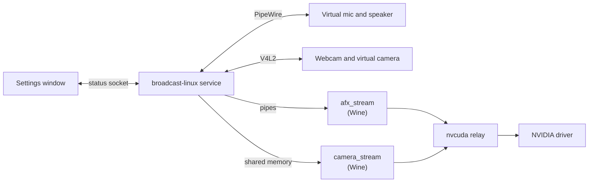
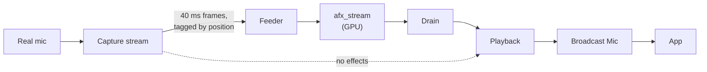
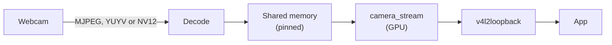

# Architecture

A Rust service owns the Linux devices. Two small Wine workers run NVIDIA's effects on
the GPU.

| Part | Role |
|---|---|
| `broadcast-linux run` | systemd user service. Starts a worker when an app uses a device, stops it when idle |
| `broadcast-linux-gui` | Settings window |
| `afx_stream.exe` | NVIDIA Audio Effects on 40 ms mono frames |
| `camera_stream.exe` | NVIDIA Video Effects and AR SDK |
| nvcuda relay | Patched Wine nvcuda that forwards CUDA to the Linux driver |
| `broadcast-linux setup` | Downloads NVIDIA Broadcast and prepares the Wine prefix |

## Audio

- **One clock:** the capture stream and the virtual node share a PipeWire node group, so they never drift.
- **Fixed delay:** each sample plays one frame plus a reserve after capture. A late frame becomes a short gap, not extra delay.
- **Reserve:** covers the worker's round trip, about 10 ms rounded up to whole PipeWire periods.
- **Speaker:** the same pipeline the other way round, from apps to the real output.

## Camera

- **Decode:** libjpeg-turbo straight to planar YUV, on several cores above 1080p30.
- **Output:** written straight into the loopback's buffers with v4l2loopback 0.14+ and `max_buffers=3`.
- **Idle:** a placeholder frame keeps the virtual camera listed.

## Latency

Measured on an RTX 50 series GPU.

### Audio

Mic or speaker with noise and echo removal, PipeWire 1.6 at its usual 512-sample period.

| Stage | Delay |
|---|---|
| NVIDIA model look-ahead | 70 ms |
| NVIDIA model frame | 40 ms |
| Reserve for the worker (one period) | 10.7 ms |
| **Total** | **121 ms** |

With every effect off, the delay is one period: 11 ms. Larger periods raise the reserve,
to 20 ms (130 ms total) at 960 samples. Measure with `tools/measure/mic-latency.sh` and
`speaker-latency.sh`.

### Camera

Logitech BRIO, MJPEG at 1080p30, with video noise removal and Studio Light.

| Stage | Delay |
|---|---|
| Webcam capture and delivery | ~33 ms |
| MJPEG decode | ~2.4 ms |
| GPU effects and transfers | ~10 ms |
| **Total** | **~46 ms** |

`parallel_decode = "on"` cuts decode to ~0.7 ms, for about 30% more decode CPU. Eye
Contact adds ~2.3 ms.
